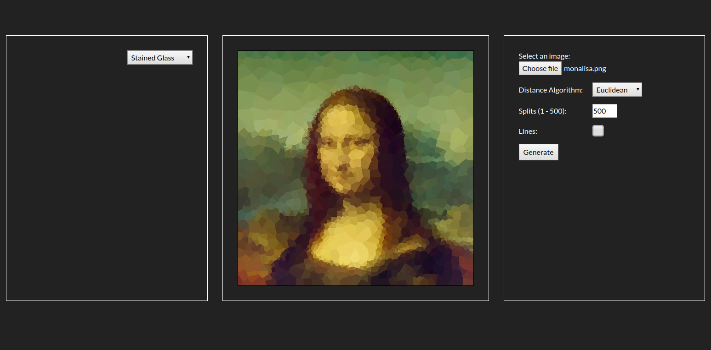

# stained-glass

Generate stained glass looking images and other effects.

https://stainglass.herokuapp.com

Must have Angular installed to run and be running the Go [server](https://gitlab.com/rileythomp14/voronoi).

`$ git clone https://github.com/rileythomp/stained-glass.git`

`$ cd stained-glass`

`$ npm i`

`$ ng serve`
